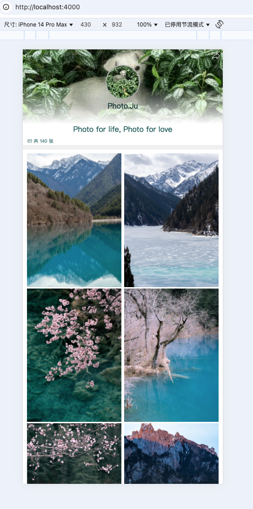
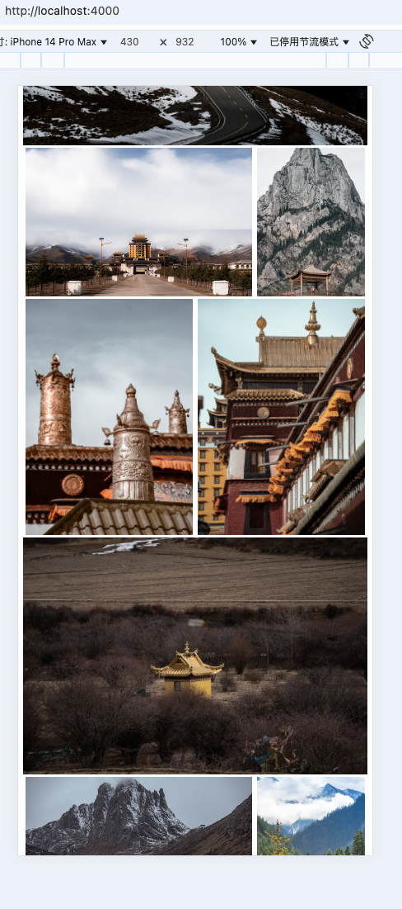
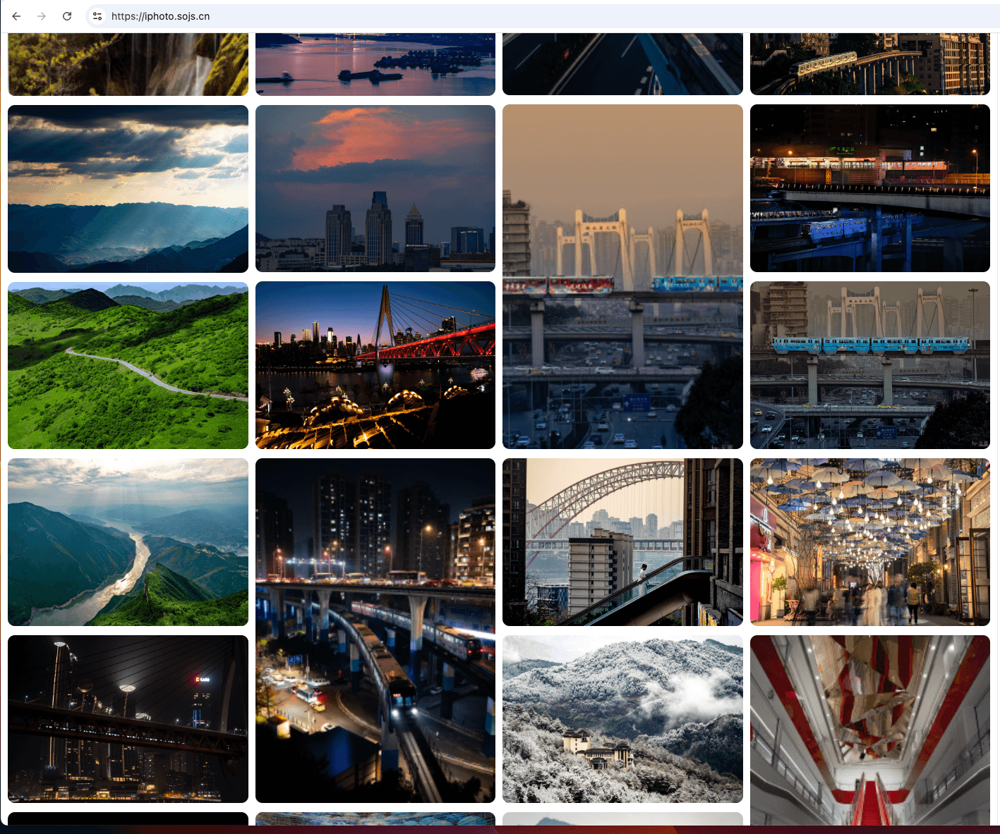
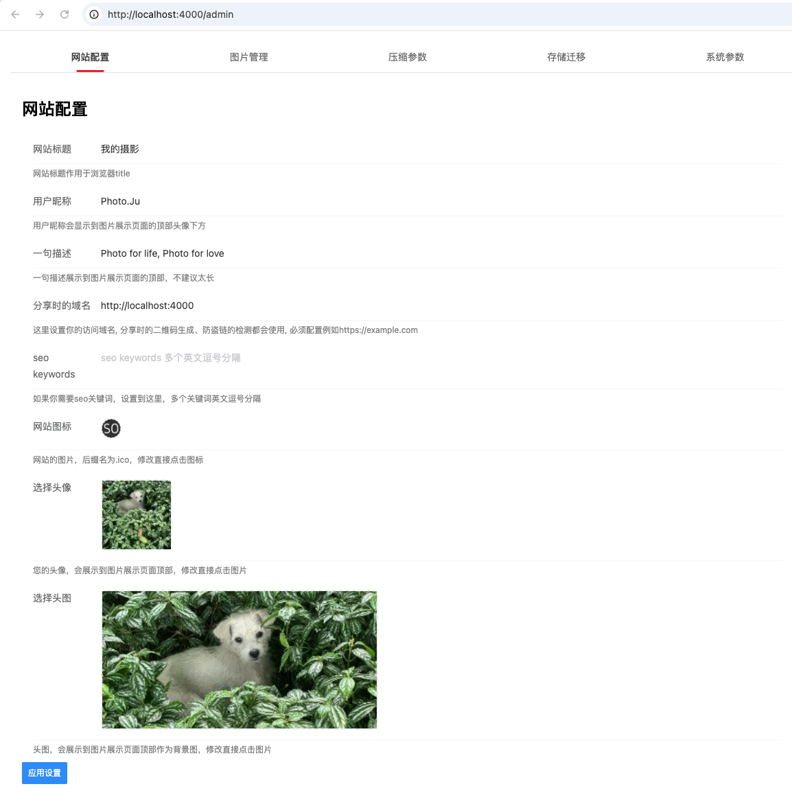
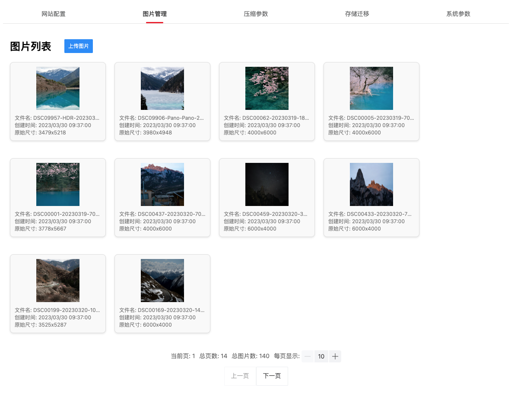
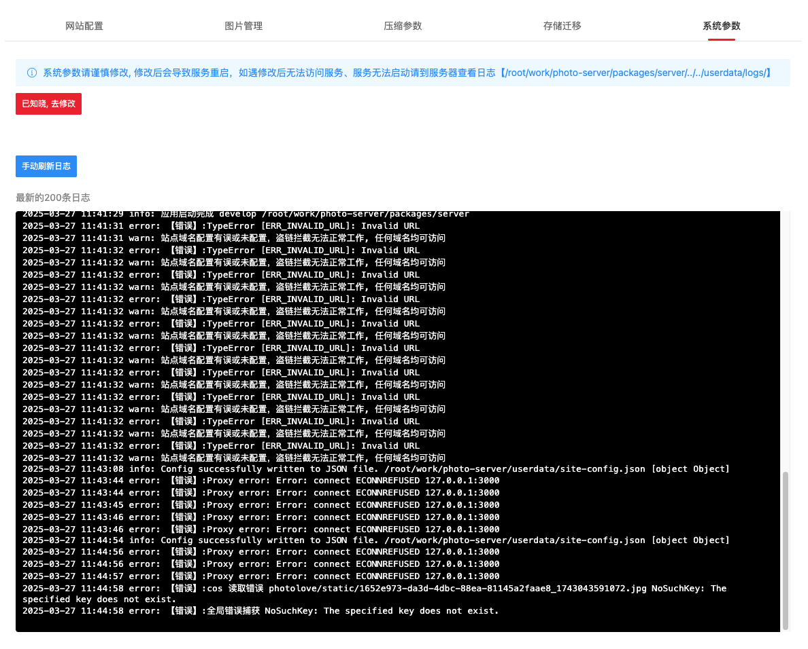

# iPhoto 项目简介
本项目是一个个人摄影照片（图床）的应用，包含后端服务、web照片管理、web照片展示首页。后端使用Nest.js框架，前端使用Vue 3 + VantUi + Vite构建。

本项目采用pnpm单仓管理，具有以下特点：
- 高效依赖管理：pnpm采用硬链接和符号链接的方式管理依赖，节省磁盘空间并提高安装速度。
- 工作区支持：通过pnpm - workspace.yaml可以方便地管理多个子项目。

存储方式多样，支持：本地文件、腾讯云COS、阿里云OSS、WebDav（通过Alist链接更多的云盘、网盘、cos）

## 待完善内容
如果有什么你想要的功能，给我提issue，如果有意义，我会抽时间来实现。
后期如果有时间我可能会实现以下功能：
- [ ] 图片附加信息管理：手动选择分类、接入ai自动分析图片分类、exif信息编辑、描述等。
- [ ] 首页根据分类展示图片
- [ ] SQLite数据库支持：不再要求一定要先安装mysql了
- [ ] 简单访问量上报及查看
- [ ] 图片点赞交互
- [ ] 数据迁移：修改存储方式后，通过异步任务把数据从一个地方复制到另一个地方。
- [ ] 优化管理端界面

## 示意图

运行效果：
[https://sojs.cn/blog](https://sojs.cn/blog) 或者 [https://iphoto.sojs.cn](https://iphoto.sojs.cn)

### 展示页面
#### 移动端效果



#### pc端效果

### 管理页面






## 不想二次开发，想直接使用？
本来想制作docker镜像安装，发现docker现在被墙得太厉害，太折腾了，有空再弄，比较推荐使用
1panel的运行环境来部署，它内部会自动把代码打包成docker镜像来运行。

### 自己部署流程
#### 安装mysql数据库
或者选择云数据库，准备好数据库的连接信息
#### 安装依赖
这些只执行一次
```bash
  # 安装全局依赖
  npm install -g pnpm
  # 安装项目依赖
  pnpm install
  # 编译前端
  pnpm build:web
```

之后项目启动推荐实用如下命令（使用pm2）
```bash
  # 启动服务端（使用pm2）, 启动后可以通过http://127.0.0.1:4000访问
  pnpm start:server
  # 如果要停止服务端
  pnpm stop:server
```
如果你是特殊的环境（1panel的运行环境），不能后台运行（后台运行会被判定为服务启动失败），你也可以使用这个命令自己运行服务
```bash
  pnpm start:server-nopm2
```

这两种启动方式的区别主要在于使用pm2能够修改系统级配置后自动重启服务生效。

> 如果你使用pnpm start:server启动服务会使用pm2来管理服务，好处是他会后台运
> 行，你修改系统配置（数据库配置等）之后，会自动重启服务让你的系统配置生效。但是如果你不用这种方
> 式启动服务，修改系统配置（数据库配置等）则不会立即生效，需要你手动重启服务。

#### 访问项目
打开浏览器，访问 `http://你的ip或域名:4000` 即可查看项目, 首次使用会进入配置模式，如果页面没自动跳转，手动访问 `http://你的ip或域名:4000/systemconfig`

#### 你需要做的事情
1. 首次使用配置数据库、存储方式等信息 `http://你的ip或域名:4000/systemconfig`，管理员密码请设置复杂点，谨防暴力破解。多次部署实例名称和数据库名称不一样则会是两套隔离数据的系统，如果重装系统再次部署，需要原来的数据，请保持实例名称和数据库名称和上次部署填写的一致。
2. 配置完进入 `http://你的ip或域名:4000/admin` 输入你的管理员密码，对站点进行配置，配置完站点之后，请一定要点击应用按钮，否则配置不会生效。站点配置页面中的域名也要配置（配置和你访问的域名是一致的就行），不然图片会因为跨域无法加载。

如果有异常，先看看/admin页面的系统配置页面中的日志，可以帮助你排查问题，当然你也可以登录服务器查看日志文件。

## 注意事项
- 请确保你的Node.js版本在18.x以上。
- 后端服务默认使用4000端口，前端服务默认使用3000端口。

## 配置文件
服务端项目使用 `/package/server/.env` 文件进行配置，请根据实际情况修改相关配置。


[项目github地址](https://github.com/gtjyj/iphoto) 欢迎fork二次开发修改，欢迎给我提新功能和优化改进的建议

## 其他交代
- 系统配置都在项目根目录 `/userdata/config.json` 文件中，你可以手动修改这个文件来修改配置。修改完记得重启服务。
- 如果你选了本地存储，你的所有图片都在项目根目录 `/userdata/${实例名称}` 下

## 二次开发流程
如果你想自己接着开发功能，你可以按照以下步骤进行：

你需要对nest.js、vue3有一定了解，然后按照以下步骤进行：
### 安装依赖
```bash
  # 安装全局依赖
  npm install -g pnpm
  # 安装项目依赖
  pnpm install
```

### 启动前端服务
建议先启动前端，因为后端会转发静态资源到前端服务
```bash
# 启动调试
pnpm dev:web
```

### 启动服务端
```bash
# 启动调试
pnpm dev:server
```

然后打开 `http://localhost:4000` 访问 ，`http://localhost:4000/admin` 访问管理端
