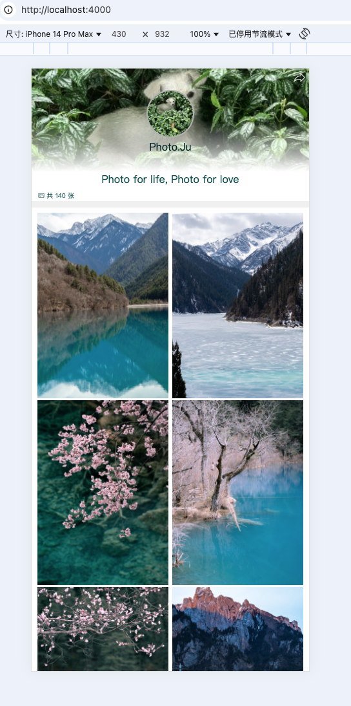
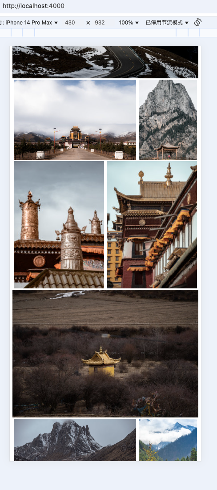
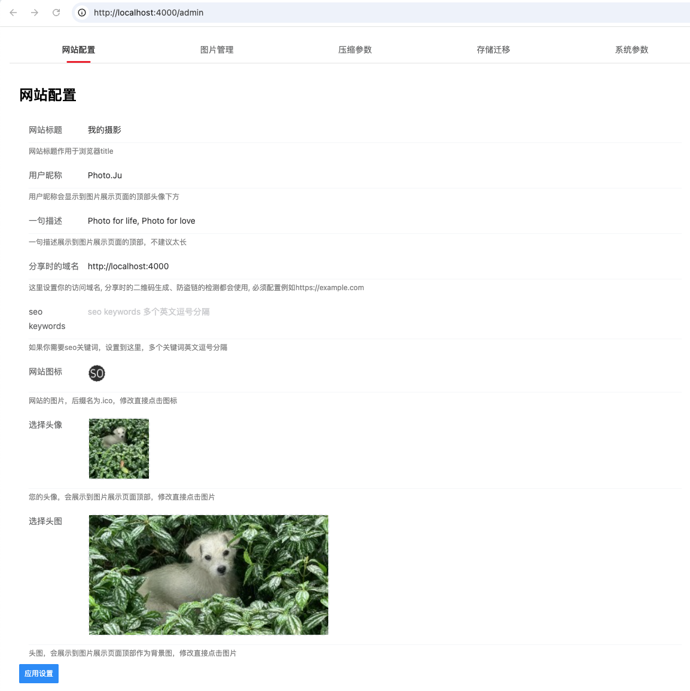
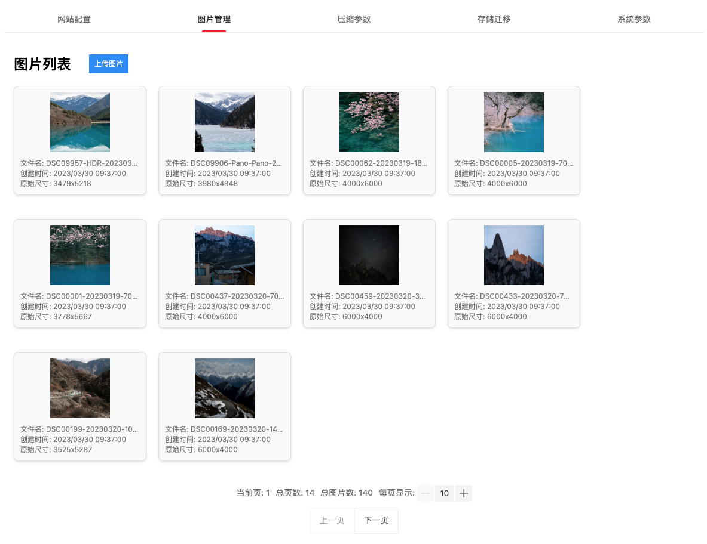
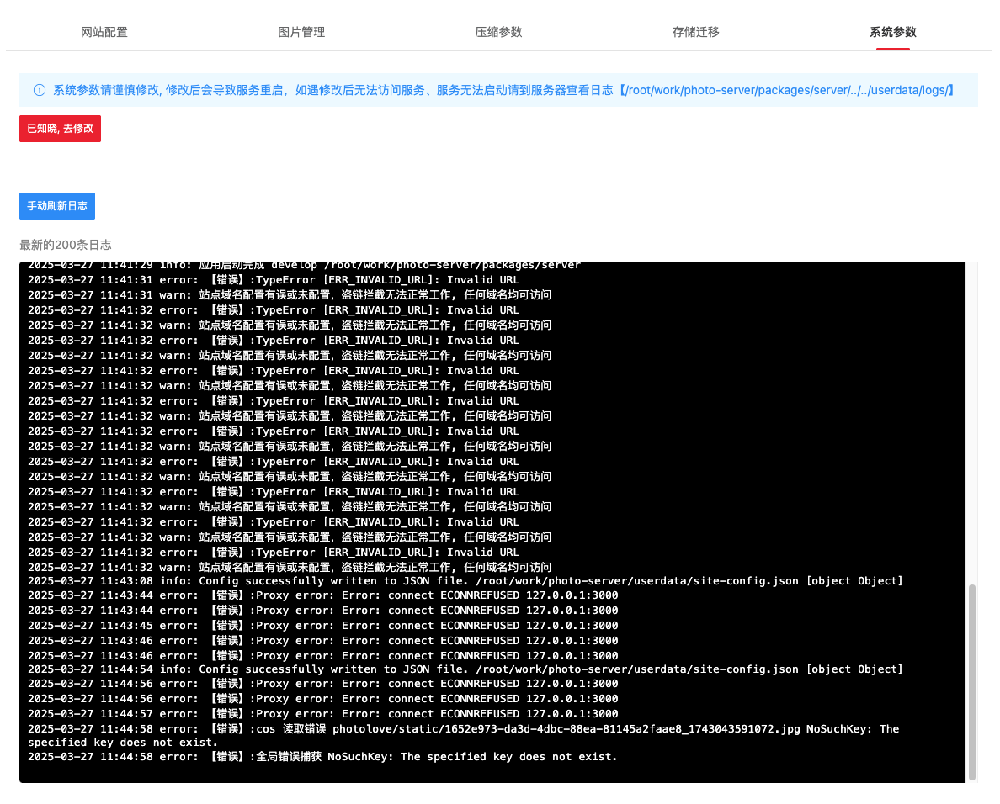

# iPhoto 项目简介
本项目是一个照片服务器，包含后端服务、web照片管理、web照片展示首页。后端使用Nest.js框架，前端使用Vue 3 + Vite构建。

本项目采用pnpm单仓管理，具有以下特点：
- 高效依赖管理：pnpm采用硬链接和符号链接的方式管理依赖，节省磁盘空间并提高安装速度。
- 工作区支持：通过pnpm - workspace.yaml可以方便地管理多个子项目。

存储方式多样，支持：本地文件、腾讯云COS、阿里云OSS、WebDav（通过Alist链接更多的云盘、网盘、cos）

## 示意图
### 展示页面



### 管理页面






## 不想二次开发，想直接使用？
本来想制作docker镜像安装，发现docker现在被墙得太厉害，太折腾了，有空再弄，比较推荐使用
1panel的运行环境来部署，它内部会自动把代码打包成docker镜像来运行。

### 自己部署流程
#### 安装mysql数据库
或者选择云数据库，准备好数据库的连接信息
#### 安装依赖
这些只执行一次
```bash
  # 安装全局依赖
  npm install -g pnpm
  # 安装项目依赖
  pnpm install
  # 编译前端
  pnpm build:web
```

之后项目启动停止就可以使用如下命令
```bash
  # 启动服务端（使用pm2）, 启动后可以通过http://127.0.0.1:4000访问
  pnpm start:server
  # 如果要停止服务端
  pnpm stop:server
```

#### 访问项目
打开浏览器，访问 `http://你的ip或域名:4000` 即可查看项目, 首次使用会进入配置模式，如果页面没自动跳转，手动访问 `http://你的ip或域名:4000/systemconfig`

#### 你需要做2件事情
1.首次使用配置数据库、存储方式等信息 `http://你的ip或域名:4000/systemconfig`
2.配置完进入 `http://你的ip或域名:4000/admin` 输入你的管理员密码，对站点进行配置，配置完站点之后，请一定要点击应用按钮，否则配置不会生效。站点配置页面中的域名也要配置（配置和你访问的域名是一致的就行），不然图片会因为跨域无法加载。

如果有异常，先看看/admin页面的系统配置页面中的日志，可以帮助你排查问题，当然你也可以登录服务器查看日志文件。

## 注意事项
- 请确保你的Node.js版本在18.x以上。
- 后端服务默认使用4000端口，前端服务默认使用3000端口。

## 配置文件
服务端项目使用 `/package/server/.env` 文件进行配置，请根据实际情况修改相关配置。

## 未来更新
如果有什么你想要的功能，给我提issue，如果有意义，我会抽时间来实现。

后期如果有时间我可能会实现以下功能：
- [ ] 图片附加信息管理：手动选择分类、接入ai自动分析图片分类、exif信息编辑、描述等。
- [ ] 首页根据分类展示图片
- [ ] 简单访问量上报及查看
- [ ] 图片点赞交互
- [ ] 数据迁移：修改存储方式后，通过异步任务把数据从一个地方复制到另一个地方。
- [ ] 开发pc版首页
- [ ] 优化管理端界面


## 二次开发流程
如果你想自己接着开发功能，你可以按照以下步骤进行：
### 安装依赖
```bash
  # 安装全局依赖
  npm install -g pnpm
  # 安装项目依赖
  pnpm install
```

### 启动前端服务
建议先启动前端
```bash
# 启动调试
  pnpm dev:web
```
### 启动后端服务
```bash
# 启动调试
  pnpm dev:server
```

## 许可证
本项目采用 [MIT许可证](LICENSE)。
